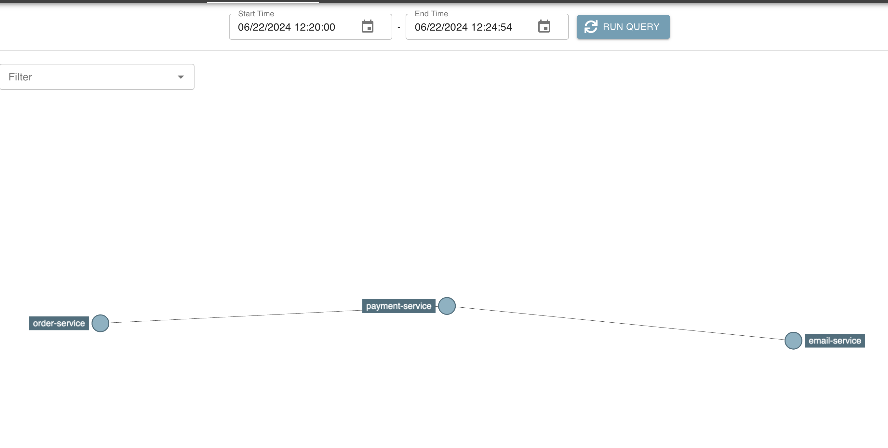

# Spring Boot 3 Open Feign - Distributed Tracing
This is a demo microservice project of Spring Boot 3 integration with Open Feign, Micrometer and Zipkin to realize distributed tracing.

## Architecture


## How to Start

First, run zipkin server in docker using following command:

```bash
# Pull the latest Zipkin Docker image
docker pull openzipkin/zipkin

# Run the Zipkin container with the name "my_zipkin"
docker run -d --name my_zipkin -p 9411:9411 openzipkin/zipkin
```

You should be able to visit `http://localhost:9411` and see the zipkin dashboard.

Then, clone this repo and install dependencies:
```shell
mvn clean install
```

Next, run all applications, and hit the order api in terminal:
```shell
curl --location 'http://localhost:8080/orders'
```

## Tech Stack
+ Spring Boot 3
+ Spring Cloud Open Feign
+ Micrometer
+ Zipkin
+ Docker


## Note

In order to enable tracing in OpenFeign, following dependency will be required additionally:

```xml
<dependency>
    <groupId>io.github.openfeign</groupId>
    <artifactId>feign-micrometer</artifactId>
</dependency>
```